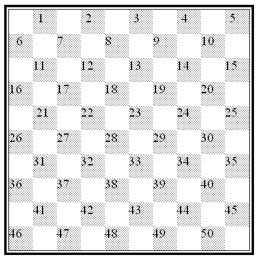

# Draughts
**Draughts board game (aka checkers)**

The code implements the "*International draughts*" variant (Dutch: "*dammen*"), so with a 10 by 10 checkered board.
> All values in the code, like board sizes, number of pieces, positions etc. are set by constants, so these could be
> changed easily.
> However, no tests are provided or promises given on the proper functioning of the code when these values are changed.

## How to build & run it!
#### Prerequisites
* This is a Kotlin Maven project, so you have to have Java and Maven correctly installed and working,
  including environment variables like `JAVA_HOME` and `MAVEN_HOME`.
  And you should be familiar with building Java (or Kotlin) projects.
* The project is hosted in GitHub, so you probably will need `git` as well.

#### Build it
To build the project, check the repository out. Then in the root directory, run `mvn clean install` to build it.
In the target directory, you will find 2 .jar-files:
 * `draughts-1.0-SNAPSHOT.jar`
 * `draughts-1.0-SNAPSHOT-jar-with-dependencies.jar`

You need the latter one (the `...-jar-with-dependencies.jar`).

#### Build it
You can then run it from the command line like this:
> ``java -cp "< path to jar file > \draughts\target\draughts-1.0-SNAPSHOT-jar-with-dependencies.jar" nl.jhvh.draughts.player.Player``

Make your command window larger when output is scrambled.

Alternatively, you can run the application in your IDE (preferably IntelliJ). I leave this to your own preference.
The class to run is `nl.jhvh.draughts.player.Player`

## Playing draughts
### Notation
According to draughts conventions for the common "*International draughts*" variant,
the playable squares on a regular Draughts board are numbered 1 to 50 like shown in the diagram below.
> Note that only the dark-colored squares can have a piece on it, and only those are numbered.
> The light-colored squares are not assigned numbers.

This draughts game uses these position numbers to specify moves.

The game is self explanatory; you get helpful feedback on how to play, and also when doing things like impossible
or not-allowed moves.

### Language
Both the code names (variables, classes etc.) and all informative feedback from the game are in English.
These feedback strings (prompts, messages, errors etc.) are hard coded (String literals) directly within the code.
The time available for this code challenge was short, so I decided to hard code these to save time.

### TODO's / FIXME's
Several `TODO`'s and `FIXME`s are left in the code, these should be handled when a production-strength application
were required, or simply about (hopefully not too dirty) workarounds.
